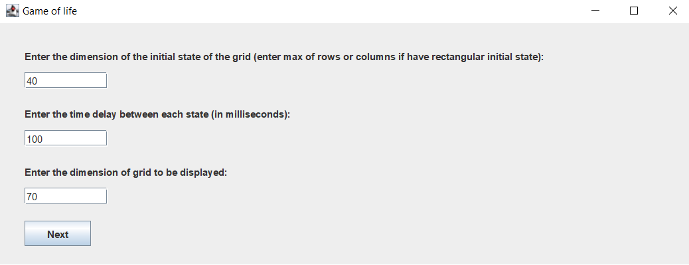
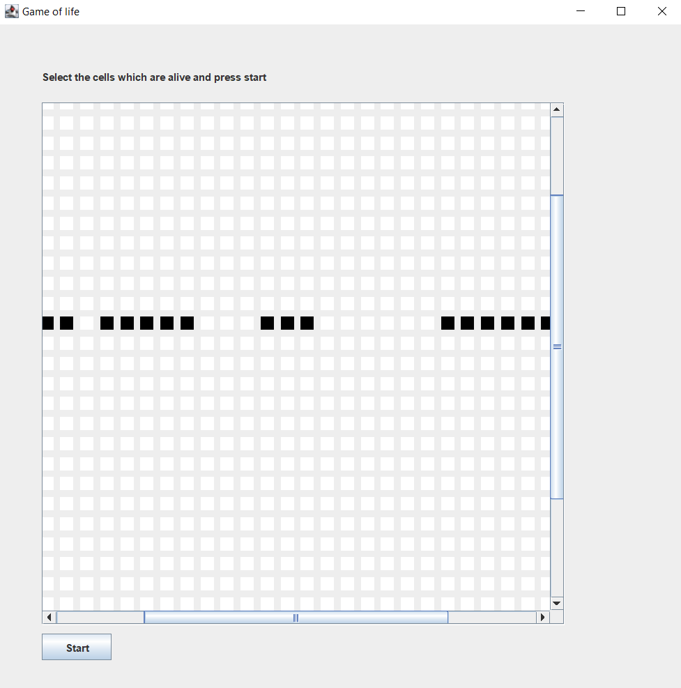
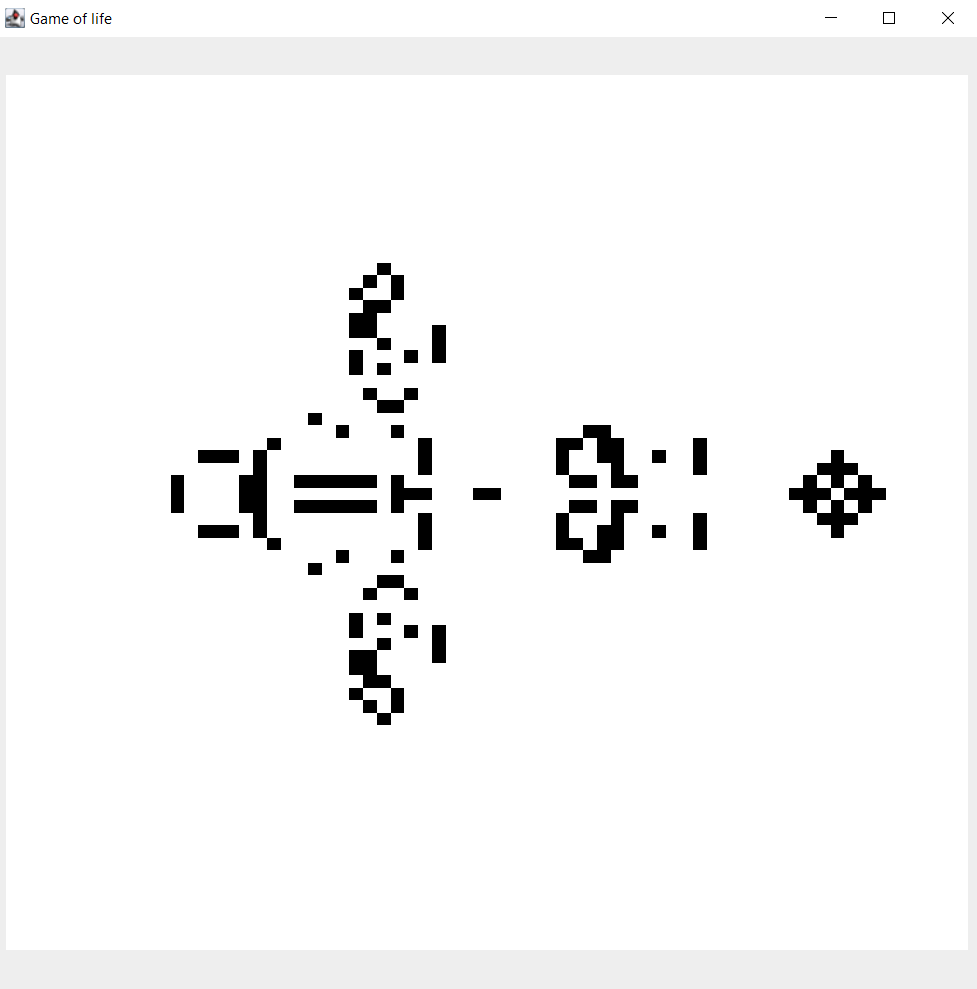

# Implementation of Conway's Game of Life with UI.

I have implemented this single player game during this lockdown sadly as I was dying to go outside.

If you don't know what game of life is and you are less than 20 then you are a just a kid you won't get what life is about(PS- It gets tougher as you get old!!). Or you can just go to [this](https://en.wikipedia.org/wiki/Conway%27s_Game_of_Life) Wikipedia link and also can check out the patterns mentioned there.

I have also implemented in an infinitely growing array and not neglecting what is happening outside the display screen.

Main class is GameOfLife.java

# Demo

I have made the UI which will first ask you to fill these:

Then you can select the initial live cells in your input grid which I have made through JCheckBox:

Here I have basically given an infinitely growing input and then just click on submit and watch as the magic happens.

### I have used JPanel grids so if the display screen is more than 80 rows it starts lagging. Although this level of grids are enough for having fun.
### You can try your own patterns or try out the patterns from wikipedia. Or you can obviously improve it.

# Thanks for reading enjoy!!
